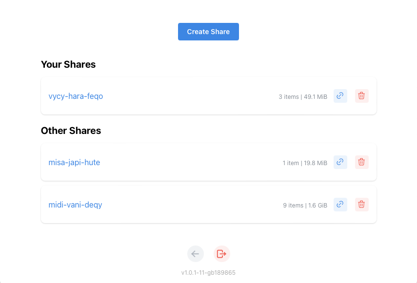
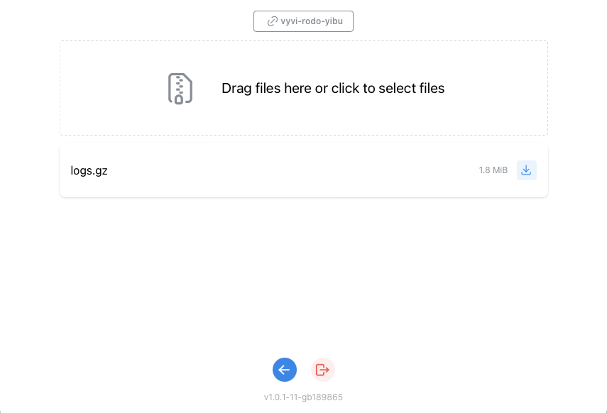

# hupload

Hupload is a minimalist file uploader for your customers.

With technical support in mind, it simplifies the process of receiving log files
or support bundles from your users.

It is a web portal and an API for direct integration into your products.

The overall concept is that share names are random tokens that can be generated
by **hupload** and are publicly accessible so users don't have to log in to 
upload content.

## Screenshots

**Admin page**


**Share page with upload box**


## Environment variables

| Variable    | Description |
|-------------|-------------|
| CONFIG      | Path to `config.yml`    |
| HTTP_PORT   | Port to run web service |

## Features

- Quickly create random links and share with users,
- Easy to use drag and drop interface for uploads,
- Configurable max share size and max file size,
- Basic share informations listed (number of items, total size),
- Automatic dark mode following OS settings,
- Multi user (all admins see all shares, but see their own listed separately first),
- API first, everything can be done through REST calls,
- Minimalist, clean interface.

## Configuration

By default, Hupload uses `data/` directory and `admin` user with a randomly
generated password that is displayed in the logs during startup.

If a configuration file is provided in `CONFIG` environment variable, it will
be used to configure storage backend and authentication.

Sample configuration file :

```
auth:
  type: file
  options:
    path: config/users.yml
storage:
  type: file
  options:
    path: data
    max_file_mb: 512
    max_share_mb: 2048
```

Currently, there is only one authentication backend `file` and one storage
backend `file`

For authentication, users are defined in a yaml file :

```
- username: user1
  password: $2y$10$LIcTF3HKNhV6qh3oi3ysHOnhiXpLOU22N61JzZXoSWQbNOpDhS/g.
- username: user2
  password: $2y$10$Rwj3rjfmXuflxds.uhgKReiXFy5VRziYuDDw/aO1w9ut9BzafTFr6
```

Passwords are hashes that you can generate with `htpasswd` :

To generate a hash for `hupload` password string :

```
htpasswd -bnBC 10 "" hupload | tr -d ":"
$2y$10$LIcTF3HKNhV6qh3oi3ysHOnhiXpLOU22N61JzZXoSWQbNOpDhS/g.
```

## Run in a container

You can quickly test **Hupload** in a container, or run it in production :

```
mkdir data
docker run -v $(pwd)/data:/data -p 8080:8080 ghcr.io/ybizeul/hupload/hupload
```

## API

The following endpoints are available under `/api/v1`

**Basic Authentication Required**

| Type     | URL                     | Description                          |
|----------|-------------------------|--------------------------------------|
| `GET`    | `/share`                | Get a list of all shares
| `POST`   | `/share`                | Create a new share with a random name
| `PUT`    | `/share/{share}`        | Create a new share named `{share}`
| `DELETE` | `/share/{share}`        | Delete a share and all its content
| `GET`    | `/share/{share}/{item}` | Get an `{item}` (file) content

**Public Endpoints**

| Type     | URL                     | Description                          |
|----------|-------------------------|--------------------------------------|
| `POST`   | `/share/{share}/{item}` | Post a new file `{item}` in `{share}` (multipart form encoded)
| `GET`    |	`/share/{share}`        | Get a `{share}` content